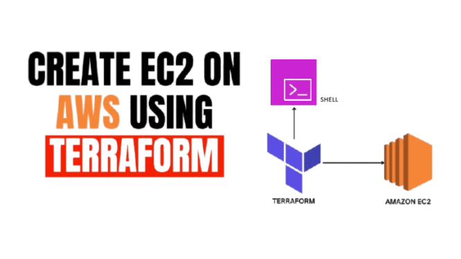
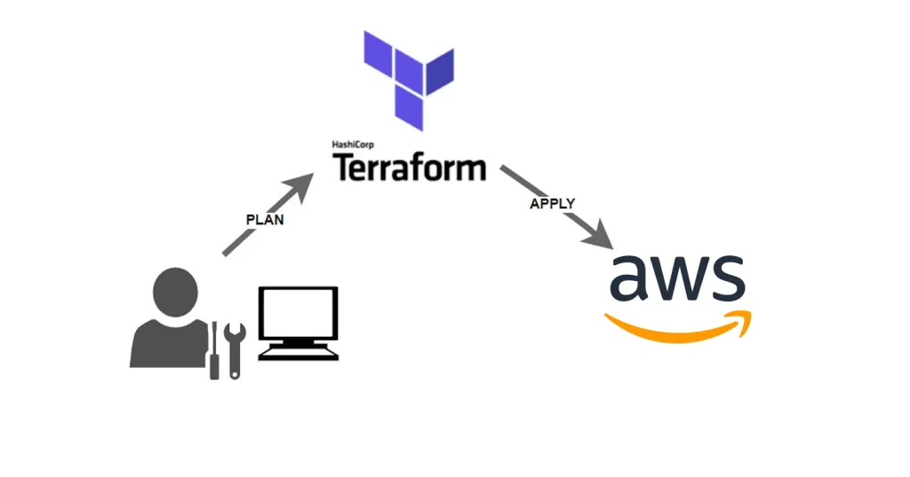

# Terraform Infrastructure

# DevOps Infrastructure as Code with Terraform

This project demonstrates how to provision cloud infrastructure using Infrastructure as Code (IaC).

The infrastructure is created on AWS using Terraform and automatically installs a web server on an EC2 instance.

# Setup instructions

    1. create repo
    2. install terraform
    3. configure aws
    4. write provider.tf
    5. write main.tf
    6. run terraform init
    7. run terraform plan
    8. run terraform apply
    9. run terraform destroy

# Project Overview

The goal of this project is to automate the provisioning of cloud infrastructure.

Terraform creates:

    • Security group
    • EC2 instance
    • Automated Apache installation

The server hosts a simple web page to verify the infrastructure is working.

# Architecture

    User Browser
        ↓
    AWS EC2 Instance
        ↓
    Apache Web Server

Infrastructure is provisioned using Terraform scripts.

# Project Structure

devops-terraform-infrastructure/  
├── provider.tf  
├── variables.tf  
├── main.tf  
├── outputs.tf  
└── README.md  

# Tools Used

Infrastructure as Code

    • Terraform

Cloud Platform

    • Amazon Web Services

Compute Service

    • Amazon EC2

<h3>Infrastructure Created</h3>

Terraform provisions:

    • 1 EC2 Instance
    • 1 Security Group

Security group rules allow:

    SSH (22)
    HTTP (80)

# Server Configuration

The EC2 instance automatically installs Apache using a user_data script.

Example configuration:

    #!/bin/bash
    dnf update -y
    dnf install -y httpd
    systemctl start httpd
    systemctl enable httpd
    echo "Hello from Terraform DevOps Project" > /var/www/html/index.html

# Deployment Workflow

Initialize Terraform:

    terraform init

Preview infrastructure:

    terraform plan

Create infrastructure:

    terraform apply

Destroy infrastructure:

    terraform destroy

What This Project Demonstrates

    • Infrastructure as Code
    • Automated cloud provisioning
    • Server configuration automation
    • AWS infrastructure management

Future Improvements

    • Add load balancer
    • Create multiple instances
    • Integrate Terraform with CI/CD pipeline

# Screenshots

Terraform Initialize

Terraform Validate

1️⃣ terraform plan output

2️⃣ Terraform Apply Success

3️⃣ EC2 instance running

EC2 Instances

EC2 Instance Security Groups

 
EC2 Instance Volumes

Node App Running on Browser via Instance IP 

4️⃣ Terraform Destroy Completion

